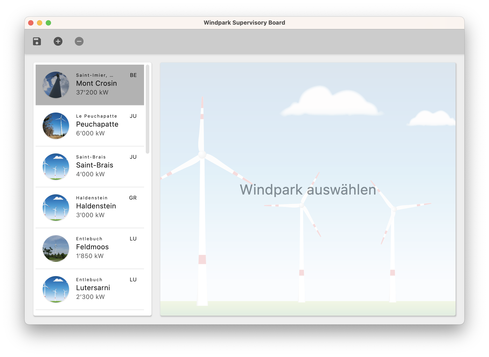
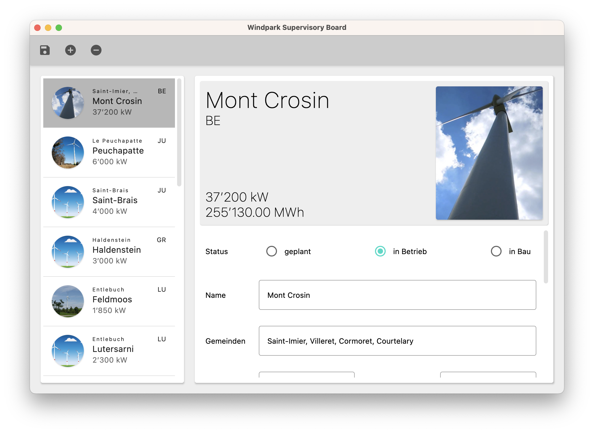

== edea Assignment 1 : WindParks

=== Bearbeitet von

* Elena Algaria

=== Abgabe

* Montag, 11.03.2024, 12:00 Uhr

Die Abgabe erfolgt durch einen `Push` auf den `main`-Branch Ihres GitHub-Repositories.

=== Initiale Schritte
[circle]
* Tragen Sie ihren Namen unter "Bearbeitet von" ein.
* Pushen Sie diese Änderung am besten sofort ins Git-Repository (z.B. via "Git -> Commit… -> Commit&Push")

=== Die Aufgabe: Desktop Applikation für die Verwaltung von WindParks

Im Projekt enthalten ist ein umfangreicher "Starter-Code". Diesen gilt es zu vervollständigen, so dass eine Applikation mit einer Toolbar und einem Master-Detail-View für Schweizer Windparks entsteht.

Diese beiden Bilder zeigen eine mögliche Lösung. Ihre Applikation muss nicht exakt so aussehen.

In `SharedComposables` sind generische Lösungen für Explorer und Editor enthalten. Diese können, müssen aber nicht, verwendet werden. Sie können Windpark-Explorer und -Editor auch komplett neu entwickeln. Je nachdem wandelt sich die Aufgabe:

* Falls Sie `GenericExplorer` und `GenericEditor` verwenden, geht es  überwiegend darum, den mitgelieferten Code zu lesen, zu verstehen, zu dokumentieren und anzuwenden.
* Falls Sie eine Neu-Entwicklung bevorzugen entsteht deutlich mehr applikationsspezifischer Code. Das Assignment ist dann eine klassische Programmieraufgabe.

=== Anforderungen
[circle]
* Gewünschte Funktionalität
** Darstellung aller Schweizer Windparks ("Explorer")
** Editor zur Veränderung eines `WindParks`
** Master-Detail-View
*** Selection-Handling im Windparks-Explorer
** neuer Windpark kann angelegt werden ("Create")
** bestehender Windpark kann gelöscht werden ("Delete")
** Windpark kann modifiziert werden ("Update")
*** Jeder Änderung eines Windparks im Editor wird sofort auch im Explorer und im Header angezeigt
** _Hinweis_: Die Verwendung einer Datenbank oder einer anderen Speichermöglichkeit ist in dieser Aufgabe nicht gefordert (kein "Save").
** klare Aufgabenverteilung zwischen Model und View
** Die Implementierungssprache für die gesamte Applikation ist Kotlin
** Das UI ist mit Compose Multiplatform for Desktop zu entwickeln
** Keine Verwendung von Libraries, die nicht bereits im Unterricht eingesetzt wurden
* TestCases
** `WindparkTest` deckt bereits einen grösseren Teil der Funktionalität von `Windpark` ab. Dieser muss nur ergänzt werden (siehe ToDos im Code).
** `ControllingInstitutionTest` soll die gesamte Funktionalität von `ControllingInstitution` abdecken.
* Code Dokumentation (falls `SharedComposables` in Verwendung)
** Alle Funktionen welche sich im File SharedComposables.kt befinden, sind entsprechend zu dokumentieren. _(Siehe Kapitel Code Dokumentation)_

=== Code Dokumentation
Falls Sie `GenericExplorer` und `GenericEditor` verwenden, muss jede Funktion der `SharedComposables` mit einem mehrzeiligen Dokumentationskommentar  ``/\**`` ``*/``  beschreiben werden.

Dabei soll das von Kotlin zur Verfügung gestellte https://kotlinlang.org/docs/kotlin-doc.html[KDoc-Format] verwendet werden.
Darin sind folgende Punkte enthalten:

. Kurzbeschreibung der Funktion
. Detailliertere Beschreibung der Funktion. Darin wird oft auch erwähnt, wann und wie genau die Funktion angewendet werden kann.
. Auflistung der Parameter/Properties/Constructors/Return-Values mit Namen und wofür diese in der Funktion verwendet werden.

**Beispiel:**

 /**
 * Komponierbare Funktion, die einen einfachen Button anzeigt.
 *
 * Diese komponierbare Funktion erstellt einen Button mit dem angegebenen [text] und dem [onClick]-Rückruf.
 *
 * @param text Der Text, der auf dem Button angezeigt werden soll.
 * @param onClick Der Callback, der aufgerufen werden soll, wenn der Button geklickt wird.
 */
@Composable
fun SimpleButton(text: String, onClick: () -> Unit) {
    Button(onClick = onClick) {
        Text(text = text)
    }
}

_Hinweis_: Natürlich können auch die eigenen Funktionen in dieser Weise dokumentiert werden.

=== Bewertung
Es können in diesem Assignment maximal 24 Punkte erreicht werden. Der Fokus liegt dabei, neben der Umsetzung der gewünschten Funktionalität, auf der Code-Qualität.

[cols=2, format=dsv]
|===
Bereich:Mögliche Punktzahl
*Funktionalitäten*:*12 Pt. Total (*0.5 falls `SharedComposables in Verwendung)*
Darstellung aller Schweizer Windparks:2 Pt.
Editor zur Veränderung eines Windparks:2 Pt.
Master-Detail-View (Selection-Handling Explorer/Editor):2 Pt.
Neuer Windpark kann angelegt werden "Create":2 Pt.
Bestehender Windpark kann gelöscht werden "Delete":2 Pt.
Windpark kann modifiziert werden "Update" (Liveupdate im Header & Explorer):2 Pt.

*Architektur*:*9 Pt. Total*
Klare Aufgabenverteilung zwischen Model und View:5 Pt.
Saubere Aufteilung der Composables in Sub-Composables:1 Pt.
Code Qualität: 3 Pt.

*Test-Cases*:*3 Pt. Total*
Todos in `WindparkTest` erledigt:1 Pt.
`ControllingInstitutionTest`deckt die gesamte Funktionalität von `ControllingInstitution`ab:2 Pt.

*Code Dokumentation falls `SharedComposables` in Verwendung*:*6 Pt. Total*
Code Dokumentation hält sich an das KDoc-Format und ist aussagekräftig: 4 Pt.
Alle verwendeten `SharedComposables` sind korrekt dokumentiert: 2 Pt.
|===

Die Note wird wie folgt berechnet und macht 20% der Gesamtnote aus.

Note = ((Erreichte Punkte / 24) * 5) + 1

== Compose Desktop Application
Für eines der Beispiele kann jeweils eine "doppelklickbare" Applikation und ein dazugehöriger Installer generiert werden.

Dazu in `src/main/kotlin/main.kt` die gewünschte Applikation eintragen.

* `./gradlew run` - startet die Applikation (ist die richtige Applikation eingetragen?)
* `./gradlew package` - erzeugt eine doppelklickbare Applikation und einen Installer (siehe  `build/compose/binaries`)
